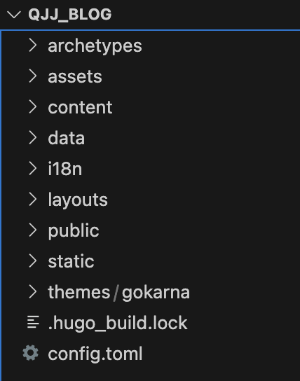

# hugo+github搭建静态个人网站

## 1. 概念与准备工作

- Hugo是利用go语言写的静态网站生成器，把markdown文件转成html；
- 需要维护两个仓库：
    - 一个保存markdown文件与图片等；
    - 另一个保存由hugo生成的静态html；
- 需要前期注册github账号，并在账户中添加本地ssh-key信息
- 需要一个趁手的编译器；

## 2. hugo安装

1. 我使用macOS直接拿安装包管理器brew安装：
    
    ```bash
    brew install hugo
    ```
    
2. 检查安装效果：
    
    ```bash
    hugo version
    ```
    

## 3. 创建github仓库：

### 3.1 先创建一个保存markdown文件和图片的仓库

- 名字随便起；
- 设置public，创建个readme；

### 3.2 创建静态页面仓库

- 仓库名称必须使用特殊格式：
    - <username>.github.io.   其中<username>是github昵称；
- 设置public，创建readme（会默认选定main作为主分支）；

## 4. 使用hugo创建网站

1. 创建网站文件夹：
    
    ```bash
    hugo new site <your_site_name>
    ```
    
2. 创建后在当前目录生成一个文件夹，cd进去可以发现文件列表如下：



- 其中，关键文件夹是content、public与themes
    - content保存博客源文件；
    - public内保存hugo生成的静态网站；
    - themes是自建或下载的网页主题；
1. hugo site放到github上：
- cd到public文件夹，``git init``声明为一个github仓库，并指定远程仓库链接``git remote add <git@xxx>``
- 回到上级目录，``hugo``命令自动生成静态网页，
- 回到public文件夹下，指定分支为main，执行如下代码即可完成操作；
```bash
git add .   
git commit -m "description about added files" 
git push origin main
```
- 之后在github上访问即可看到静态网站；
# 未完待续。。。