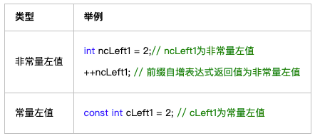
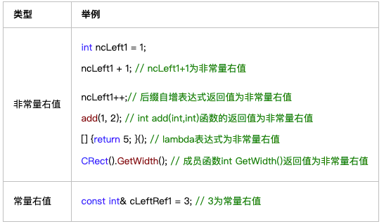

## 本篇记录一下C++11中的右值引用
参考blog：https://www.cnblogs.com/kekec/p/10810507.html

### 1. 什么是左值和右值：
- 左值：**非临时的**（具名的，可在多条语句中使用，可以被取地址）。可以出现在等号的左边或右边。可分为非常量左值和常量左值。

- 右值：**临时的**（不具名，只在当前语句中有效，无法取地址），只能在等号右侧出现，也分为非常量右值和常量右值。

### 2. 什么是左值引用和右值引用：
说白了，右值引用就是数据类型的一种，给右值起一个别名方便后续操作；

### 3. 右值引用的作用：
主要用途是支持 **移动语义** 和 **完美转发**
#### 什么是移动语义：
基于```std::move()```函数，返回一个传入参数的右值，实现资源传递；
通过移动语义可以实现类的移动构造与移动赋值运算符，避免临时对象的资源复制，提高效率；
#### 什么是完美转发：
允许函数模版完美转发参数类型，保持参数的左右值属性不变；
实际上，在转发左值或者右值的时候，```forward<T>``` 和 ```static_cast<T&&>```作用相当；
（转发将参数下发到其他函数中，即使传递进来的是右值，因为赋变量名也会被转为左值转发，所以需要类型转换）；
具体请参考：
[完美转发](C++完美转发.md)


