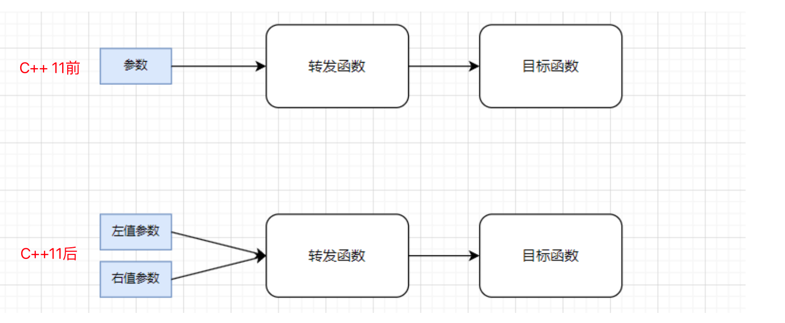
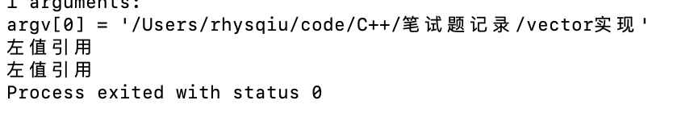
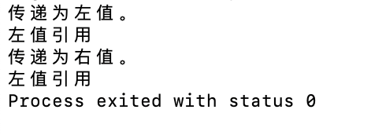
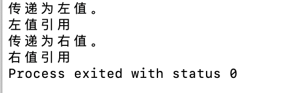

## 本篇学习一下C++完美转发
在c++中，难免遇到将函数参数原封不动的传递给另一个函数的场景，称为**参数转发**；
**完美转发**就是为了在参数传递的过程中，**避免不必要的拷贝或移动**，保持参数的**原始类型与属性**而来；
- **保持参数的类型与属性**：保持参数的左值、右值属性；
- **避免不必要的拷贝与移动**：正确区分参数的左值、右值属性，避免不必要的拷贝、移动开销以及性能问题；主要是通过转发函数处理。

可以说，因为移动语义的出现，推动了完美转发的出现。
#### 1. 冲突场景
- 考虑下面的场景，因转发函数中未能识别传递的参数val是左值还是右值，因而全部按照拷贝构造函数处理；
```c++
#include <iostream>

using namespace std;

class Test{
    public:
        Test(const string& other){
            cout<<"左值引用"<<endl;
            val = other;
        }
        Test(const string&& other){
            cout<<"右值引用"<<endl;
            val = other;
        }
    private:
        string val;
};

Test makeTest(string val){
    return Test(val);
}

int main(){
    string tmp = "10";
    makeTest(tmp);
    makeTest("10");
    return 0;
}
```
- 执行结果：

    - 全部按照拷贝构造执行，因为下发的参数是左值，对于右值传递的情况，发生了两次深拷贝；
#### 2. 引用折叠
- 即使利用引用折叠，使得转发函数接收右值类型，仍旧无法完成对返回对象的移动构造函数调用:
```c++
#include <iostream>
#include <type_traits>

using namespace std;

class Test{
    public:
        Test(const string& other){
            cout<<"左值引用"<<endl;
            val = other;
        }
        Test(const string&& other){
            cout<<"右值引用"<<endl;
            val = other;
        }
    private:
        string val;
};

template<class T>
Test makeTest(T&& val){
    if(is_lvalue_reference<T&&>::value)
        cout<<"传递为左值。"<<endl;
    else
        cout<<"传递为右值。"<<endl;
    return Test(val);
}

int main(){
    string tmp = "10";
    makeTest(tmp);
    makeTest(move(tmp));
    return 0;
}
```
- 输出如下：

    - 这里仍旧调用两次拷贝构造函数；
    - 如果代码中显式地调用了拷贝构造函数，那么即使传递的是右值，也会使用拷贝构造函数。
- 引用折叠细则：
    - 有一个引用是左值类型，将折叠为左值引用；
    - 剩余场景都将折叠为右值引用；
#### 3. 完美转发场景
- 通过```forward<T>```实现；
    - 其实 forward<T> 和 static_cast<T&&>作用相同；
```c++
#include <iostream>
#include <type_traits>

using namespace std;

class Test{
    public:
        Test(const string& other){
            cout<<"左值引用"<<endl;
            val = other;
        }
        Test(string&& other){
            cout<<"右值引用"<<endl;
            val = other;
        }
    private:
        string val;
};

template<class T>
Test makeTest(T&& val){
    if(is_lvalue_reference<T&&>::value)
        cout<<"传递为左值。"<<endl;
    else if(is_rvalue_reference<T&&>::value)
        cout<<"传递为右值。"<<endl;
    return Test(forward<T>(val));
    //return Test(static_cast<T&&>(val));
    //执行结果是一样的；
}

int main(){
    string tmp = "10";
    makeTest(tmp);
    makeTest(move(tmp));
    return 0;
}
```
- 执行结果：

    - 正确传递了右值，并执行移动构造函数；

#### 问题：
1. 既然T&&和T都能正确传递引用类型，为何不用T？
    - 因为使用T会导致传递常量时发生拷贝构造；
2. 为什么引用折叠例子中，第二个move移动语义执行后的转发函数仍会执行拷贝构造？
    - 编译期就确定这部分调用的构造函数类型，而move不会改变tmp的左右值属性；
    - 当 makeTest(move(tmp)) 被调用时，std::move 将 tmp 转换为右值引用，但模板参数 T&& 仍然被推导为 string&，因为 std::move 并没有改变 tmp 的左值/右值属性，它只是告诉编译器 tmp 可以安全地作为右值引用处理。
    - 所以需要forward去改变传递来参数的引用属性从而达到完美转发；


