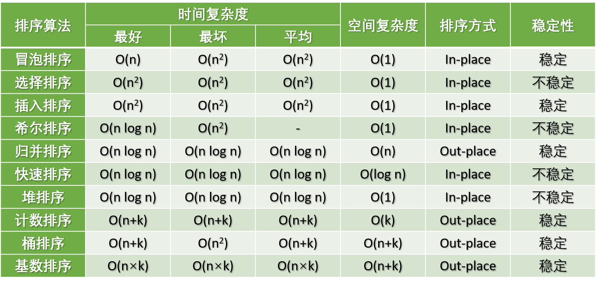

参考了博主的文章
原文链接：https://javaguide.cn/cs-basics/algorithms/10-classical-sorting-algorithms.html


## 1. 排序算法分类：
### 可以分为：
- 内部排序：数据记录在内存中进行排序。
- 外部排序open in new window：因排序的数据很大，一次不能容纳全部的排序记录，在排序过程中需要访问外存。
### 术语说明:
- 稳定：
如果 A 原本在 B 前面，而 A=B，排序之后 A 仍然在 B 的前面。
- 不稳定：如果 A 原本在 B 的前面，而 A=B，排序之后 A 可能会出现在 B 的后面。
- 内排序：所有排序操作都在内存中完成。
- 外排序：由于数据太大，因此把数据放在磁盘中，而排序通过磁盘和内存的数据传输才能进行。
- 时间复杂度：定性描述一个算法执行所耗费的时间。
- 空间复杂度：定性描述一个算法执行所需内存的大小。

## 2. 常见的排序算法
常见的内部排序算法有：
- 插入排序、希尔排序、选择排序、冒泡排序、归并排序、快速排序、堆排序、基数排序等，本文只讲解内部排序算法。
- 用一张图概括：

## 3. 基于比较的排序算法
- 常见的快速排序、归并排序、堆排序以及冒泡排序等都属于比较类排序算法。

### 3.1 冒泡排序：
- 交换数值排序，动图如下：

- 评价：
   - 稳定，最好O(n)，最差O(n^2)，平均O(n^2)；
- 代码实现：
```
#include <>
```

### 3.2 选择排序：
- 每次选待排序数组中最大值（最小值）放在数组首位；
- 算法步骤
    - 首先在未排序序列中找到最小（大）元素，
    - 存放到排序序列的起始位置
    - 再从剩余未排序元素中继续寻找最小（大）元素，然后放到已排序序列的末尾。
    - 重复第 2 步，直到所有元素均排序完毕。
- 评价：
   - 不稳定，最好O(n)，最差O(n^2)，平均O(n^2)；
